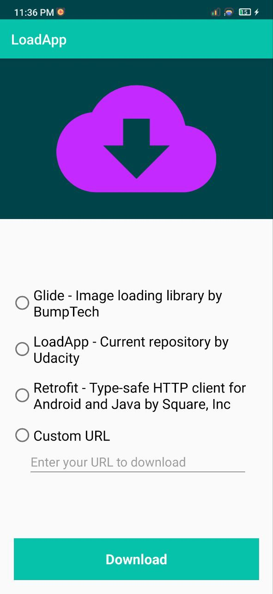
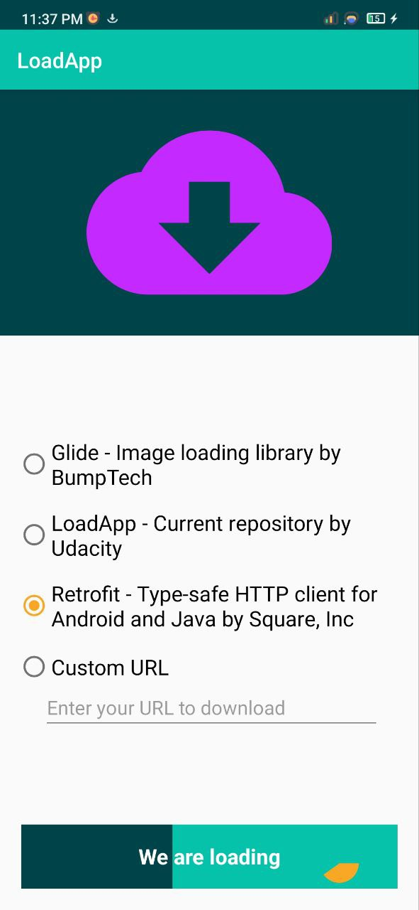
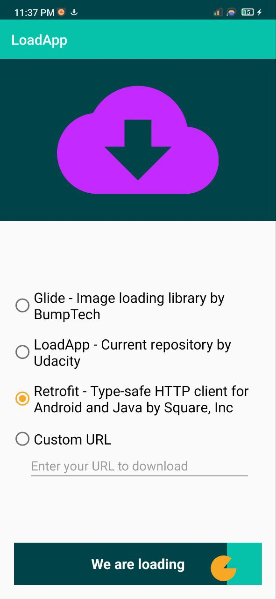
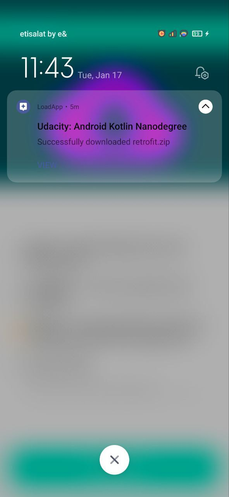
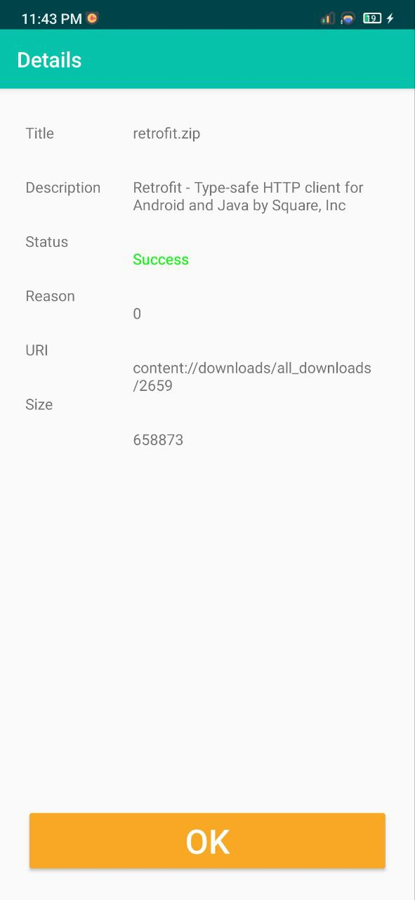

# udacity-loadapp
Udacity Nanodegree: Advanced Android Kotlin Development - Project 3

## Screenshots

<table>
  <tr>
    <td></td>
    <td></td>
    <td></td>
  </tr>
  <tr>
    <td></td>
    <td></td>
  </tr>
</table>
